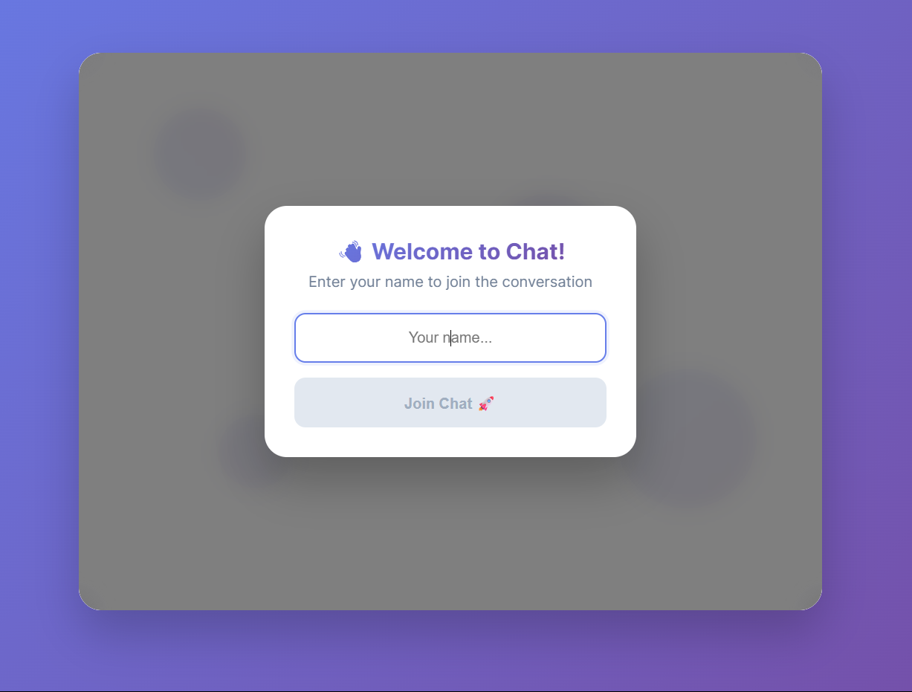
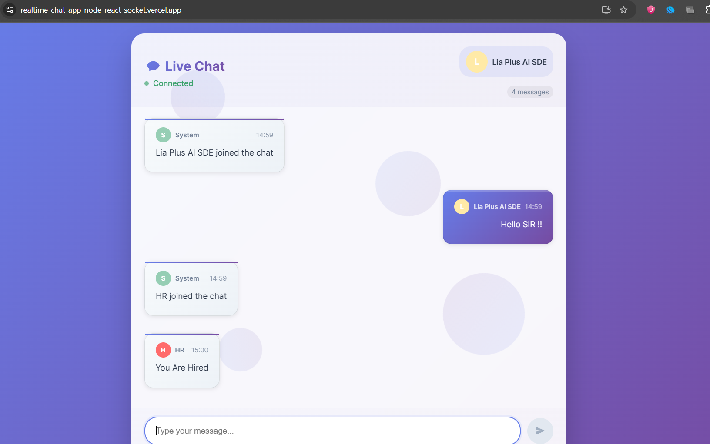
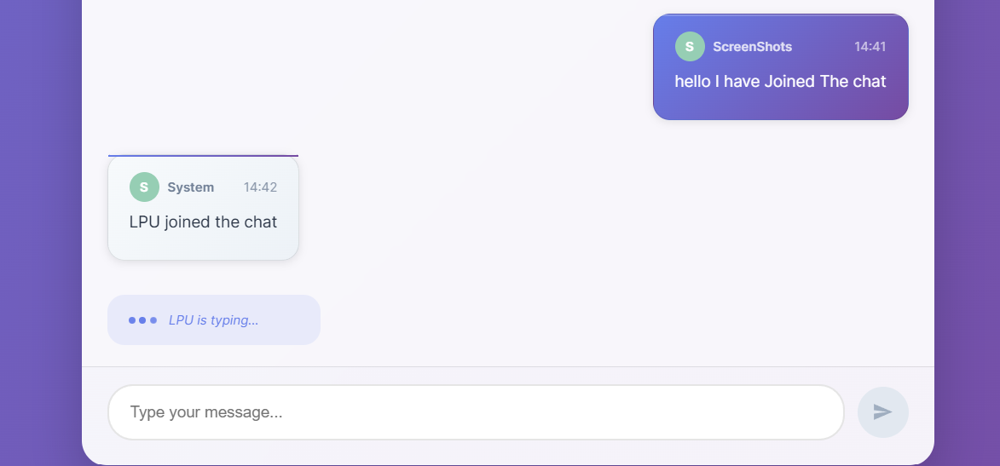

# 💬 Real-Time Chat App – Node.js, React, Socket.IO

A fully functional, real-time chat application built using **React**, **Node.js**, **Express**, and **Socket.IO**.  
It enables users to join a shared chatroom, exchange messages in real-time, see when others are typing, and receive system notifications when users join or leave.

---
## 📸 Screenshots

Here are a few screenshots of the real-time chat app in action:

### 💬 Chat Interface  


---

### 📥 Message Sent & Received View  


---

### ✍️ Typing Indicator  


---

## 🚀 Live Demo

🌐 **Frontend**  
🔗 [https://realtime-chat-app-node-react-socket.vercel.app](https://realtime-chat-app-node-react-socket.vercel.app)

⚙️ **Backend**  
🔗 [https://realtime-chat-app-node-react-socketio.onrender.com](https://realtime-chat-app-node-react-socketio.onrender.com)

🧪 **Try It Out**  
Open the frontend link on **two different devices or browser tabs**, enter different usernames, and start chatting in real-time! 🚀💬  
You’ll see messages and typing indicators update live with Socket.IO magic ✨

---

## 📦 Features

- 🔴 Real-time messaging using WebSockets
- 👥 Multi-user chatroom
- 🙋 Join/Leave system messages
- ✍️ Typing indicators
- 🧑‍💻 Per-user session usernames
- 📱 Responsive mobile/desktop view
- 🗃️ In-memory chat history (last 100 messages)
- 🧼 Clean, modular code (ideal for portfolio)
- 📊 Backend API endpoints (health check, stats)

---

## 🧱 Tech Stack

| Layer     | Technology            |
|-----------|------------------------|
| Frontend  | React, Socket.IO Client |
| Backend   | Node.js, Express, Socket.IO |
| Protocol  | WebSocket (via Socket.IO) |
| Styling   | CSS (inline + component-specific) |

---

## 📁 Folder Structure

```
real-time-chat-app-node-react-socketio/
├── backend/
│   ├── server.js
│   ├── package.json
│   ├── .gitignore
│
├── frontend/
│   ├── src/
│   │   ├── App.js
│   │   ├── Chat.js
│   │   ├── index.js
│   │   ├── App.css
│   │   └── Chat.css
│   ├── public/
│   ├── package.json
│   ├── .gitignore
│
├── README.md
├── requirements.md
```

---

## ⚙️ Getting Started – Local Setup

### Prerequisites

- Node.js (v16+ recommended)
- npm (Node package manager)
- Git (optional)

---

### 🔹 Clone the Repository

```bash
git clone https://github.com/YOUR_USERNAME/real-time-chat-app-node-react-socketio.git
cd real-time-chat-app-node-react-socketio
```

---

### 🔹 Start the Backend Server

```bash
cd backend
npm install
npm start
```

Runs backend on: `http://localhost:5000`

---

### 🔹 Start the Frontend React App

Open another terminal:

```bash
cd frontend
npm install
npm start
```

Runs frontend on: `http://localhost:3000`

---

## 🔄 Realtime App Flow

1. User joins with a username
2. System announces their arrival to all users
3. Messages are sent/received instantly
4. Typing indicator appears for active users
5. Leaving triggers a system exit message

---

## 🔌 Backend API Endpoints

| Endpoint       | Description              |
|----------------|--------------------------|
| `/`            | Welcome message          |
| `/health`      | Server status, uptime    |
| `/stats`       | Online users, memory info|
| `/messages`    | Recent chat history      |

---

## 📦 Requirements

See full list in [`requirements.md`](./requirements.md)

#### Backend dependencies:

```bash
cd backend
npm install express socket.io cors
```

#### Frontend dependencies:

```bash
cd frontend
npm install react react-dom socket.io-client
```

---

## 🚀 Deployment Guide

You can deploy this full-stack real-time chat application using free services:

- 🔵 **Frontend** → Vercel (React App)
- 🟢 **Backend** → Render (Express + Node.js server)

---

### ✅ FRONTEND DEPLOYMENT – Vercel (Free)

#### Step-by-Step:

1. Go to [https://vercel.com/](https://vercel.com/)
2. Login with GitHub and import your repository
3. Select the `frontend/` folder as the **project root**
4. Set:
   - Framework: `React`
   - Build Command: `npm run build`
   - Output Directory: `build`
5. Click **Deploy**
6. After deployment, you’ll get a URL like:

```
https://your-frontend.vercel.app
```

---

### ✅ BACKEND DEPLOYMENT – Render (Free)

#### Step-by-Step:

1. Go to [https://render.com/](https://render.com/)
2. Click **New → Web Service**
3. Connect your GitHub repo
4. Select the `backend/` folder
5. Set:
   - Environment: `Node`
   - Build Command: `npm install`
   - Start Command: `node server.js`
   - Root Directory: `backend`
6. Click **Create Web Service**
7. After deployment, your backend URL will look like:

```
https://chat-backend.onrender.com
```

---

### 🔁 Final Integration Steps

#### 1. Update React to point to live backend

In `frontend/src/Chat.js`:

```js
// Replace:
const socket = io("http://localhost:5000");

// With:
const socket = io("https://chat-backend.onrender.com");
```

#### 2. Update CORS in `backend/server.js`

```js
cors: {
  origin: [
    "http://localhost:3000",
    "https://your-frontend.vercel.app"
  ],
  methods: ["GET", "POST"],
  credentials: true
}
```

---

## 🔐 Security Notes

This project uses in-memory storage and no authentication.

For production:
- Add login system (JWT, OAuth)
- Save messages in MongoDB or PostgreSQL
- Sanitize input & prevent spam

---

## 👨‍💻 Author

**Nandan Patnaik**  
🎓 B.Tech CSE, Batch of 2026  
🔗 [Your LinkedIn or Email Here]

---

## 🧾 License

MIT License  
Feel free to fork, modify, and deploy!

---

## 🙌 Acknowledgements

- [React](https://reactjs.org/)
- [Express](https://expressjs.com/)
- [Socket.IO](https://socket.io/)
- [Vercel](https://vercel.com/)
- [Render](https://render.com/)
